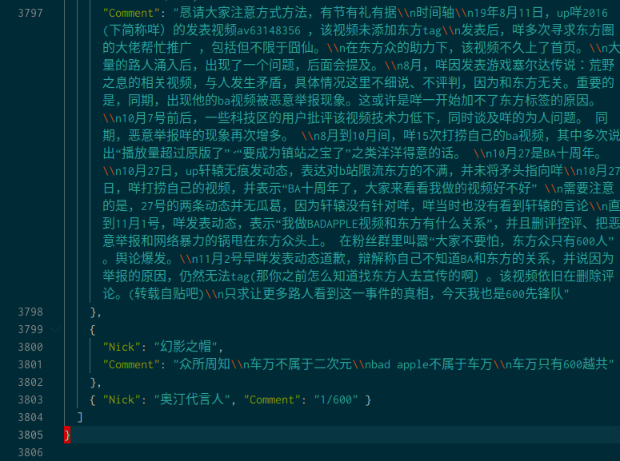
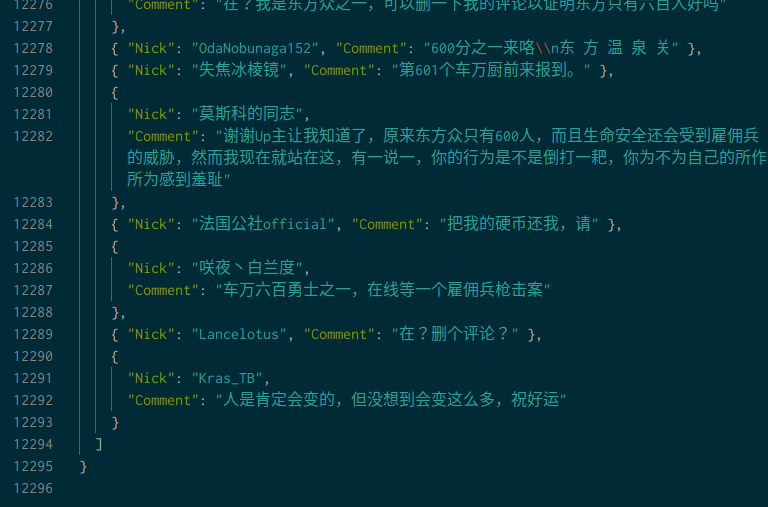
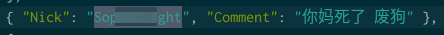

<!--
 * @Author: your name
 * @Date: 2019-11-03 10:30:09
 * @LastEditTime: 2019-11-03 23:13:04
 * @LastEditors: Please set LastEditors
 * @Description: In User Settings Edit
 * @FilePath: /the_Destruction_of_bad_apple/README.md
 -->

# 关于屑站up主"咩2016"对于2019年11月03日进行恶意控评行为的相关数据分析

> 事件的相关发展和某咩的不良言论不在本项目讨论的讨论范围,想了解的请移步其他文章

## 声明

- 简化说明
  - up主"咩2016",以下简称**某咩**
  - 某咩相关对东方爱好者,科技爱好者开战的事件和所有相关的**事件**,以下简称**BA事件**
  - 对于某咩使用的控评技术(无论是脚本还是人工),以下简称**神必脚本**
  - 某个没有tag的视频,以下称为BA事件本篇
- 隐私相关
  - 名义上为了保存数据,但是本项目收集评论区的行为本质上是不道德的  
  - 对与账户和评论区已经被收录进入了展示数据或担心自己的信息被收录的  
  - 请在**屑站通过私信**通知我,我会无条件删除与您相关的数据,并**提前表示歉意**
  - 若不口头通知,将视为默许了我的行为,不过对此依然表示谢谢茄子

- 关于存储库
  - 所有稳定的服务最早部署时间为Sat Nov 2 14:45:10 CST 2019
    - 也就是说在之前的时间被删评的情况记录不完整或没有记录
  - 该库在于客观了解某咩的删评操作,所有本人看法我都会加上标识
    > - **技术,不是你的挡箭牌**
  - 关于库的存废问题
    - 相关数据发布公网时间自部署到UP主**绝大多数东方爱好者**表示**原谅**
    > - 注意上述**原谅**的条件并不要尝试调转矛头
    > - 别搞得和我的@方法COSA 在红色警戒爱好者里面迫真道歉一样
    - 在满足上述条件后,公共库将转为私有库
    > - 也就是说,我将不会删除对应数据,而且是某些公网不能放的数据
    > - 当年亦被@石国鹏讲历史 这样的人蒙骗,单凭所谓的道歉书了事而删除了不良言论的记录,以至于后面逍遥给屑站环境和石国鹏本人带来巨大不良影响
    > - 诸如此类的原因,证据将永远保留,直到(某咩被封号&&我存储介质容量不够用了),(:-D)

## 简述

- 爬取某咩关键动态和BA事件起因的视频下所有评论,备份可能被神必脚本削除的评论和保留罪证
- 分析某咩各视频下评论区的用户账号状态,判断某咩的活跃粉丝和出现在新动态洗地的用户是否有关联性,判别是否有买粉丝买水军的情况
  - (正在开发中)

## 说说当前的情况

自Sat Nov 2 14:45:10 CST 2019第一个稳定的爬虫程序开始工作后
对BA事件的本篇进行了评论区数据整理,以下只针对BA事件本篇的评论区变加以描述  
截止到Sat Nov 3 03:45:10 CST 2019

### 被保存的新评论

- 不完全统计14000条(有重复)
- 
  - 按照单线程的抓取速度,估算重复的系数K=110
  - 应该为140000/110估1272条
  - 根据个人编写的分析程式,反馈到反复刷评论的用户数约为10人,且多集中在第二天后
  - 所以初步判断这来评论区的不止600斯巴达勇士了(:-D)

已经被编码的JSON格式,3806行

已经被编码JSON格式,12296行

### 分析

- 活跃粉丝情况
  - 针对本篇评论区置顶位置的av号(下称"视频前av号")进行爬取,简单的对比在置顶列表av号中评论用户的出现次数,再将这些粉丝对应到本篇,锁定核心粉丝
  - 当然在上述处理的过程中发现了很有意思的事情,在初略定位的核心粉丝中,有半数都发表了"取消三连返还硬币"的言论
    - > 不得不说人民群众是的眼睛是雪亮的
    - > 核心粉丝也不是你的挡箭牌
  - 当前的分析工作还是很初级,分析的视频还不够多,爬虫也不够稳
    - > 谁叫我不是CS班科了,,,

- 车万人情况
  - 如保存的本篇数据看,很明显光评论区人数已经破1000了
    - 所谓东方project是小圈子,车万人数不过600的言论不攻自破
  - 一些有趣的情况
    - 一些核心粉丝(当前确定范围)和头像和昵称是车万相关的,实际上有相当大的重合度
    - > 或许某咩"不是支持我的粉丝不是车万人"这句话,我的意思,,,
    - > 就这个现象反驳一些拿"这是野生技术协会不算东方二创"的洗地言论,既然一个作品题材是东方,受众是东方群众,互动活跃的是东方群众,在东方社区平台推广(某咩原罪之一),单纯创作形势是EE相关技术,那就是不算东方了?
    - > 放着现代电子乐的大河剧的武田信玄被讨死,就武田信玄不是战国将军了.啊!我领悟力
    - 虽然没有爬轩辕的评论区(其实也不应该爬),但自己去轩辕看了一下各个转发评论区的情况,有瞄了一眼终端上的输出结果
      - 是基本所有的(在轩辕理客中评论&&核心粉丝&&车万群众),在在某咩发布激寒言论后举了反旗

- 神必的删评脚本

说到这我心中大失所望,因为为了构建及时分析删评情况的程式和测试各种可能的干扰我熬夜到3:00,并第一时间处理了原始数据并挂在电脑和nano派上滚去睡觉了,可是结果是...
  
#### 被删除评论区

- 一人,只有一人(心情复杂)
  - 那位幸运嘉宾是(保护隐私隐私已经打马)
  - 
  - 恭喜这位幸运嘉宾上台领奖(错乱)

- 真的,我的程序确实测试了很完备了,甚至可以抵御如小万邦bot那样的胡言乱语(比如某些转义字符让我编写的正则表达式失效),单评论区删评的检测,我也用我的"囧仙混响玩具"的那个视频测试了,除非发完就删,都是可以获得的到的的,,,

#### 一些毫无根据的推测

> 注意,当前标题下均为我极为主观的言论,如果不妥当其指出,让我了解自己的错误

- > 如果我的终端反馈没有一个评论被删除,那可能是我的问题
- > 但是确实捕获到了一个评论被删除,所以这一切推测都建立在我的程序没有问题的基础上

- 可能性其一,泰国第几的脚本
  - 删评脚本并不难找,也不难编写,但是要想识别的准,需要大量的构思过滤策略
  - 策略的失衡带来了拦截效率的匮乏和准度的缺少
  - 或许这泰国第几的策略是真的只拦下了"600人"了,大家误会他了(:-D)

- 可能性其二,高并发被屑站橄榄
  - 大量的东方群众涌入使得评论区数据并发巨大
  - 机制不完全的删评脚本无视了数据通量对屑站发起了高频调用请求
  - 理所当然的被屑站橄榄
  - 相关内容我不是班科出身我也不好描述,这有几个github上的有关屑站的api文档,明确了高并发处理会被屑站办停账号操作
    - Vespa314 / bilibili-api
    - fython/BilibiliAPIDocs
    - WhiteBlue/bilibili-sdk-go
  - 如果是这个可能性,那击破了如下言论
    - "自己弄了个sever"
      - 某咩的脚本可能是随便下的,自己都不做性能限制和增加新的关键词的
    - "自建黑名单,最大XXX人"
      - 解释一些那么多举反旗的为什么没就去啊
      - 还有那个幸运嘉宾为什么这么幸运啊

- 某大手子出手动动指头就把某咩给橄榄了
  - 车万人刚刚某算法国家基本比赛头等奖,恐怕没人不知道吧
  - 高手如云,我们只不过是芸芸众生,但为同一个兴趣爱好在一起交流
  - 人外有人天外有天,请对文化和技术带有敬畏之心

## 后记

> 注意,当前标题下均为我极为主观的言论,如果不妥当其指出,让我了解自己的错误

- 距离昨天下午1:00开始作业,到现在2019年11月03日13:07:30,其中睡觉3小时,下厨洗澡不完全统计4小时,具体多少时间我不清楚了,反正这个周末是埋里面了,胡言乱语言论不当请多多包涵并指出
- 非本科出身学CS累死我了(绝句)
- 正则表达式写起来好烦啊(绝句)
- 本科学机械机械设计的现在弄一堆文本处理,头要糊了(绝句)
- 好了不(绝句)了
- 仓库后面会上传文中时间段本篇下的评论区,还是开头的,如果觉得被爬不合适,我会删掉这些信息的,当然必要是本人哦
- 只是做了微小的工作,不是班科出身某些细节上的东西确实不可恭维现在是(自己写的golang+别人的python和c+linux 下各种奇技淫巧的数据处理+excel和cad这些奇妙深刻的传统工具)
- 因为上一条的原因,为了防止相关程式被反制,暂时不开源
- 但是我的目的,就是开发一套硬汉检测工具,迟早是会上线的,哪怕一个月半年
- 最后胡言乱语,golang真好用
  - go是神,我们要信他
  - GO IS GOD
  - GO IS HIV(错乱)